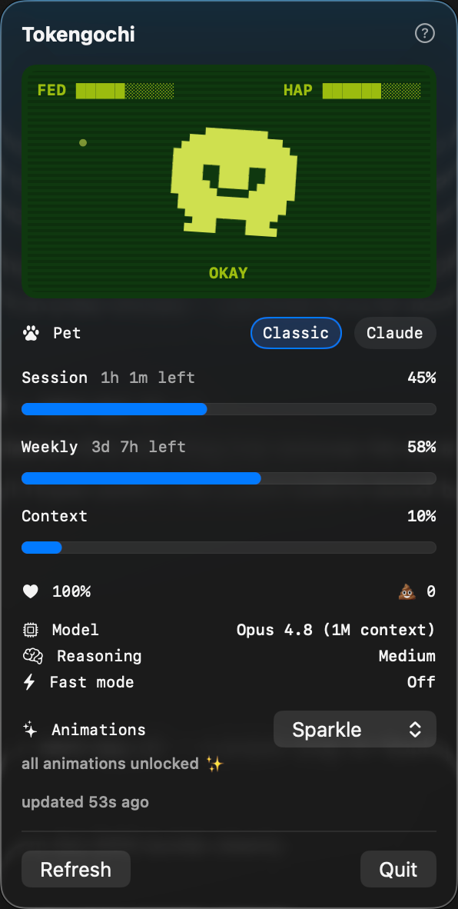
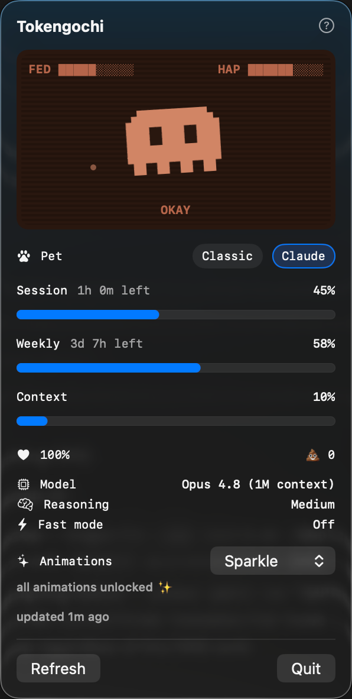

# Tokengochi

A macOS menu-bar virtual pet that *is* your Claude and Codex usage. Session usage feeds it, weekly usage keeps it happy, and neglect (wasting your session window) leaves a mess you can only clean by coming back and using your coding agents.

<p align="center">
  
  &nbsp;&nbsp;
  
</p>

## Architecture

```
Claude Code statusline ──stdin JSON──▶ TokengochiWriter ──────▶ snapshot-claude.json
Anthropic OAuth usage API ◀──polls── TokengochiPoller ────────▶ snapshot-claude.json
Codex JSONL / hook JSON ───stdin JSON──▶ TokengochiCodexWriter ─▶ snapshot-codex.json
                                                                          │ polled
                                                                          ▼
                                                               Tokengochi.app (menu bar)
```

There are separate snapshots per provider:

- **TokengochiWriter** — a statusline command interactive Claude Code runs. It captures the `rate_limits` / `context_window` JSON Claude Code pipes to stdin and writes it to `~/Library/Application Support/Tokengochi/snapshot-claude.json`. It can chain to your existing statusline so you keep it (see below). This is the only source that includes **context-window %**, but it only fires while you're in an interactive Claude Code TUI session.
- **TokengochiPoller** — a standalone fetcher for everyone who *doesn't* sit in interactive Claude Code (e.g. you drive your subscription through T3 Code, the Agent SDK, or anything that wraps Claude Code). It reads your Claude OAuth token from the macOS Keychain and calls Anthropic's `/api/oauth/usage` endpoint — the same data behind Claude Code's `/usage` — then writes the snapshot. It fills session + weekly %; context % is per-conversation and not available here. Run it on a schedule (see below).
- **TokengochiCodexWriter** — reads Codex JSONL events from `codex exec --json` output, or hook JSON containing usage payloads, and writes `~/Library/Application Support/Tokengochi/snapshot-codex.json`. Codex values are estimated from local observed token activity unless an exact quota source is added later.
- **Tokengochi** — the menu-bar app. Polls provider snapshots, runs the pet engine, and shows one menu-bar item. The popover shows provider panels side by side when both are locally available, or a single panel when only one provider is available.
- **TokengochiKit** — shared model + the `PetEngine` care logic.

## Build

```sh
swift build -c release
```

Binaries land in `.build/release/`.

## Test

`PetEngine` (window rollover, mess accrual, auto-clean, mood/health) is covered by `TokengochiKitTests`.

```sh
swift test
```

With full Xcode installed this works as-is. On a Command Line Tools–only machine the Swift Testing framework isn't on the default search path, so point at it explicitly:

```sh
FW=/Library/Developer/CommandLineTools/Library/Developer/Frameworks
LIB=/Library/Developer/CommandLineTools/Library/Developer/usr/lib
swift test -Xswiftc -F -Xswiftc "$FW" -Xlinker -rpath -Xlinker "$FW" -Xlinker -rpath -Xlinker "$LIB"
```

## Run the app

```sh
.build/release/Tokengochi
```

It lives in the menu bar (no Dock icon). It shows one menu item with the active provider status icons.

## Package for distribution

To produce a shareable `.app`, run:

```sh
./make-app.sh 0.1.0
```

This builds the release binaries, assembles `dist/Tokengochi.app`, ad-hoc signs it, and writes two shareable artifacts: a `dist/Tokengochi-0.1.0.zip` and a `dist/Tokengochi-0.1.0.dmg` (a drag-to-`Applications` disk image). The bundle ships the menu-bar app in `Contents/MacOS/`, and `TokengochiWriter`, `TokengochiPoller`, and `TokengochiCodexWriter` in `Contents/Helpers/`, so a single download has everything. Hand people the `.dmg` for the familiar drag-to-install flow, or the `.zip` if they'd rather just unzip.

To give it an icon, drop a 1024×1024 `AppIcon.png` in the repo root; the script generates `AppIcon.icns` from it on the next run (or commit your own `AppIcon.icns` directly).

Because the app is ad-hoc signed rather than notarized, the first launch on someone else's Mac is blocked by Gatekeeper — regardless of whether they got the `.dmg` or the `.zip`. They open it once via **right-click → Open → Open** (or System Settings → Privacy & Security → "Open Anyway"); after that it launches normally. For zero-warning distribution you'd need a paid Apple Developer ID plus notarization.

## Wire up the statusline writer

Tokengochi reads data that only Claude Code can provide, via its statusline hook. Point your statusline at the writer in `~/.claude/settings.json`. To keep your current statusline (e.g. `claude-hud`) visible, pass its command through:

```json
{
  "statusLine": {
    "type": "command",
    "command": "TOKENGOCHI_PASSTHROUGH_CMD='<your previous statusLine command>' /absolute/path/to/.build/release/TokengochiWriter"
  }
}
```

If you don't set `TOKENGOCHI_PASSTHROUGH_CMD`, the writer prints a minimal `🐣 S:.. W:..` line as your statusline.

If you installed the packaged app, the writer lives inside the bundle — point the command at `/Applications/Tokengochi.app/Contents/Helpers/TokengochiWriter` instead of the `.build` path.

## Feed Codex usage

Codex support is local and estimated in this version. Pipe JSONL output from `codex exec --json` into the writer:

```sh
codex exec --json "summarize this repo" | .build/release/TokengochiCodexWriter
```

The writer accumulates observed `turn.completed.usage` token fields into `snapshot-codex.json`. You can tune the estimated percentage budgets:

```sh
TOKENGOCHI_CODEX_SESSION_TOKEN_BUDGET=200000 \
TOKENGOCHI_CODEX_WEEKLY_TOKEN_BUDGET=2000000 \
codex exec --json "summarize this repo" | .build/release/TokengochiCodexWriter
```

If you installed the packaged app, use `/Applications/Tokengochi.app/Contents/Helpers/TokengochiCodexWriter`.

## Run the poller (no interactive Claude Code needed)

If you don't live in the Claude Code TUI — you use **T3 Code**, the Agent SDK, or any other wrapper around your subscription — the statusline writer never fires. Use the poller instead. It needs Claude Code installed and signed in *once* (so the OAuth token exists in your Keychain); after that it refreshes the snapshot on its own.

If you installed the packaged app, substitute `/Applications/Tokengochi.app/Contents/Helpers/TokengochiPoller` for the `.build` path in the commands below (including the LaunchAgent `sed`).

One-shot:

```sh
.build/release/TokengochiPoller
```

Watch mode (foreground loop, default 60s; override with a number):

```sh
.build/release/TokengochiPoller --watch 120
```

Run it automatically with a LaunchAgent (recommended — survives logout/reboot):

```sh
sed -e "s|__POLLER_PATH__|$(pwd)/.build/release/TokengochiPoller|" \
    -e "s|__LOG_PATH__|$HOME/Library/Logs/tokengochi-poller.log|" com.tokengochi.poller.plist \
  > ~/Library/LaunchAgents/com.tokengochi.poller.plist
launchctl bootstrap gui/$(id -u) ~/Library/LaunchAgents/com.tokengochi.poller.plist
launchctl kickstart -k gui/$(id -u)/com.tokengochi.poller   # force an immediate first poll
```

It polls every 120s and logs to `~/Library/Logs/tokengochi-poller.log`. To stop: `launchctl bootout gui/$(id -u)/com.tokengochi.poller`. (The older `launchctl load`/`unload` verbs fail with "Input/output error" on recent macOS — use `bootstrap`/`bootout`.)

**First run** the binary reads the `Claude Code-credentials` Keychain item, so macOS may show a one-time "wants to use confidential information" prompt — click **Always Allow**. If the token expires the poll returns HTTP 401; opening Claude Code or T3 Code refreshes it.

## Known constraint

The Claude poller depends on a valid OAuth token kept fresh in your Keychain by Claude Code / T3 Code — it does not implement the token-refresh flow itself, so if you go a long time without launching either, polls will 401 until you do. Context-window % is only available via the statusline writer (it's per-conversation, not an account-wide limit). Codex percentages are estimated from local JSONL token observations, not exact account quota. Between successful updates the app shows last-known values with an "updated Nm ago" indicator and uses each limit's reset timestamp to roll windows over where available.
